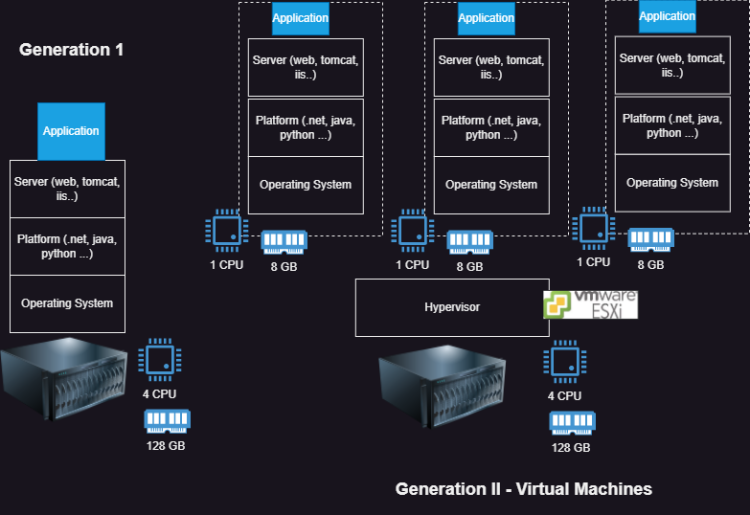
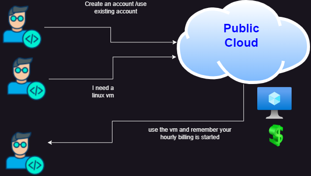

# Virtualization

## Overview of Virtualization

## Cloud
 - Cloud is all about using someone else’s hardware
 - We have discussed about regions, zones and datacneters
 * Types of Cloud
  - Public cloud
  - Private Cloud
  - Hybrid Cloud
  - Community Cloud
  - Multi Cloud

 1) Public cloud:
  *  Here we will have  Cloud Services Provider (CSP) like  Azure, AWS, GCP owning infrastructure (Regions, Zones, Datacenters) and  Cloud service Consumers creating accounts and using services

  

**Need to Learn the All Cloud usecase somebrief**

## Service:
   - What cloud offers
   - Here CSP has ownership
## Resources:
   - What we create
   - Here consumers have ownership

### Cloud Services Provider
  - Azure is a Public cloud services provider
  - They organize the infrastructue across
  - Physical Hierarchy:
      Region > Zones > Datacenters > Racks > Server
      

Explore Globe of Azure [Refer Here](https://datacenters.microsoft.com/globe/explore/) and [Refer Here](https://datacenters.microsoft.com/tour/) for data center tour

      
      

