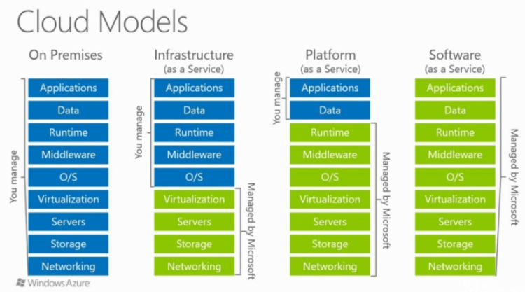
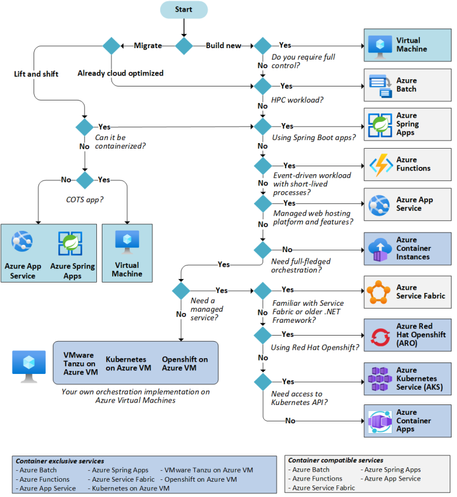
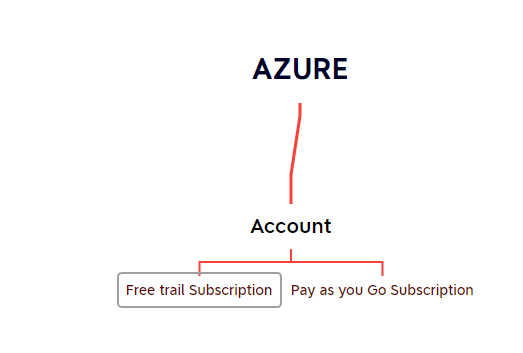

# IaaS vs PaaS vs SaaS

**1. IaaS (Infrastructure as a Service)**
  * (You manage OS, runtime, networking; Azure provides infra)

**2. PaaS (Platform as a Service)**
 * (You manage applications & data; Azure manages OS, runtime, scaling, infra)

**3. SaaS (Software as a Service)**
 * (End-user ready applications; no infra/platform management)

**4.FaaS (Functions as a Service / Serverless)**

## Overview Image

## Azure Compute Services
 * Choosing the Right Azure Compute Service

## Some EXamples for IAS/PAS/SAS Services Below

### **IaaS (Infrastructure as a Service)**
 * (You manage OS, runtime, networking; Azure provides infra)

       * Azure Virtual Machines (VMs)
       * Azure Virtual Machine Scale Sets (VMSS)
       * Azure Disks
       * Azure Blob Storage
       * Azure Virtual Network (VNet)
       * Azure Load Balancer
       * Azure Firewall
       * Azure ExpressRoute
       * Azure Bastion

### **PaaS (Platform as a Service)**
 * (You manage applications & data; Azure manages OS, runtime, scaling, infra)

       * Azure App Service
       * Azure Spring Apps
       * Azure Kubernetes Service (AKS)
       * Azure Container Instances (ACI)
       * Azure SQL Database
       * Azure Cosmos DB
       * Azure Cache for Redis
       * Azure Service Bus
       * Azure Logic Apps
       * Azure Event Hub

###  **SaaS (Software as a Service)**
 * (End-user ready applications; no infra/platform management)

       * Microsoft 365 (Office 365: Outlook, Teams, Word, Excel, SharePoint)
       * Microsoft Power BI
       * Microsoft Dynamics 365
       * Microsoft Intune
       * Azure DevOps Services (Repos, Boards, Pipelines as SaaS)
       * OneDrive for Business

### **FaaS (Functions as a Service / Serverless)**

*  (Event-driven code execution, no server management)
*  Azure Functions
*  Azure Event Grid
*  Azure Logic Apps (serverless workflow orchestration)

## Billing
 * Azure charges for services
     * Unit of time: generally hourly in few services its second
     * If you give long term commmitment ( 1 year or 3 years) we get extra discounts (Azure Reservations/Azure Service Plans)
     * To make revenue out of free hardware they run some auction kind of model (Azure Spot Instances)
       * **Azure Reservations/Azure Service Plans**
       * **(Azure Spot Instances)**

# Azure Account Creation
 * Our Accounts: Free tier
   * [Refer Here](https://azure.microsoft.com/en-us/pricing/purchase-options/azure-account?icid=azurefreeaccount)
   
   * Azure Free tier

   
   * Enterprise Accounts

## Ways of Working in Azure
* We have 3 major ways of accessing azure
    * From Browser (Portal)
    * From Command Line (Azure CLI)
    * From Templates (IaC/ ARM Templates/Azure Bicep)

# Quick Start: Create a Linux Virtual Machine
 - [Refer Here](https://learn.microsoft.com/en-us/azure/virtual-machines/linux/quick-create-portal?tabs=ubuntu) for Azure Quickstart