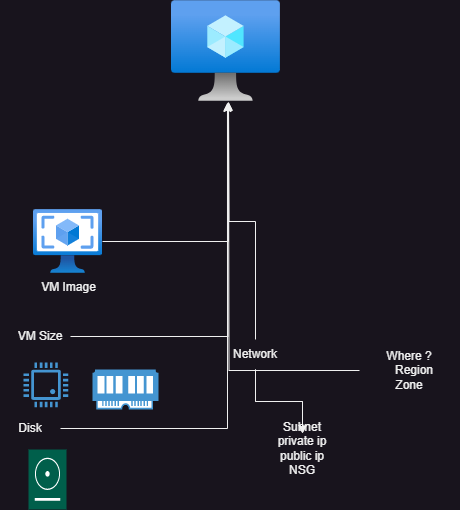
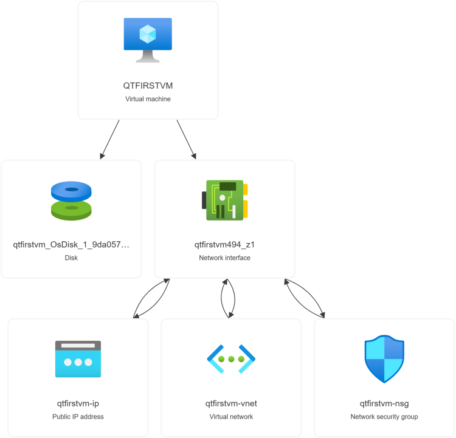
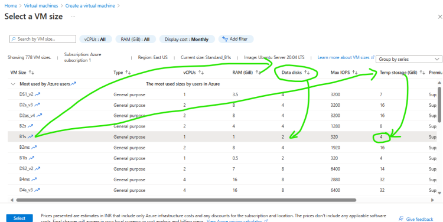

# Azure Virtual Machines
  * This is a service offered by Azure to create virtual machines
  * Internally Azure Virtual machines depend on other components
  * For any virtual machines at a bare minimum we need to configure the below details
    * Virtual Machine Images: Azure has three types of images
       * OS images
       * Market place
       * Custom images
  * VM Basic Requiremnets
       * Network
       * Disk
       * Location
       * Size

 *  We have create a Virtual machine and then the **Resource visualizer** image is as shown below

 

## Azure Virtual Machine has 3 types of disks
 * OS Disk:
     * Non Ephemeral i.e. Disk contents will be available even after deleting virtual machine 
     * This disk contains OS
 * Data Disk
    * Non Ephemeral i.e. Disk contents will be available even after deleting virtual machine
    * This disk contains contents other than OS
 * Temp Disk
    * Ephemeral Storage i.e. Disk contents will be wiped once the vm is shutdown
 * Temp Disk Size is based on VM Size and Number of Disks which can be attached to vm are also dictated by vm size

 