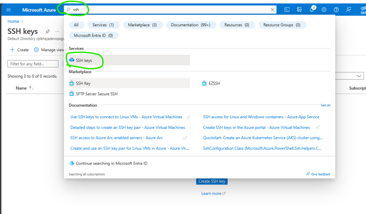
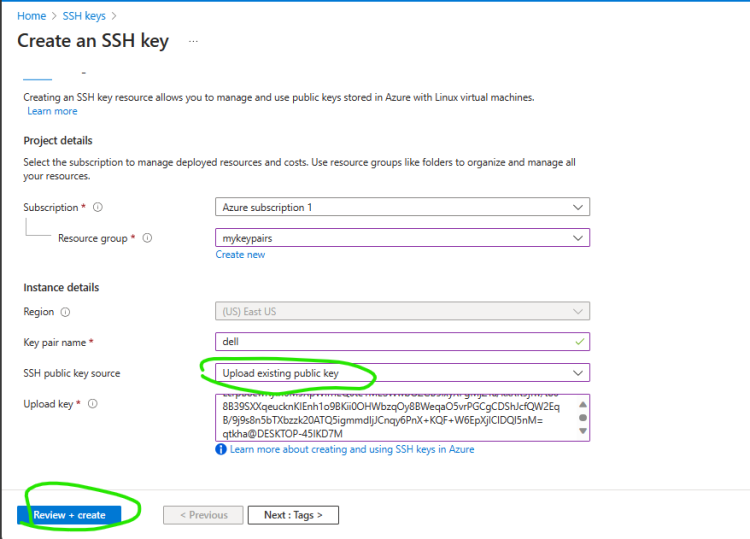
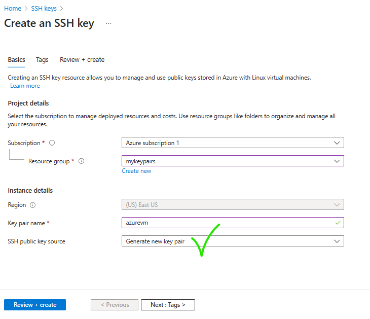
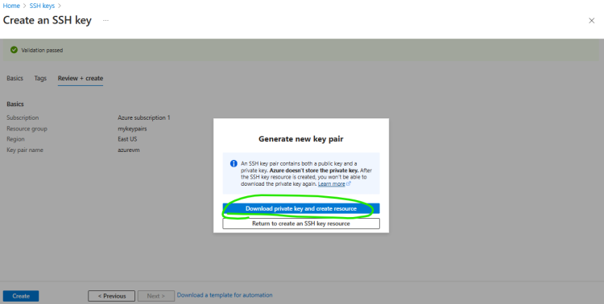
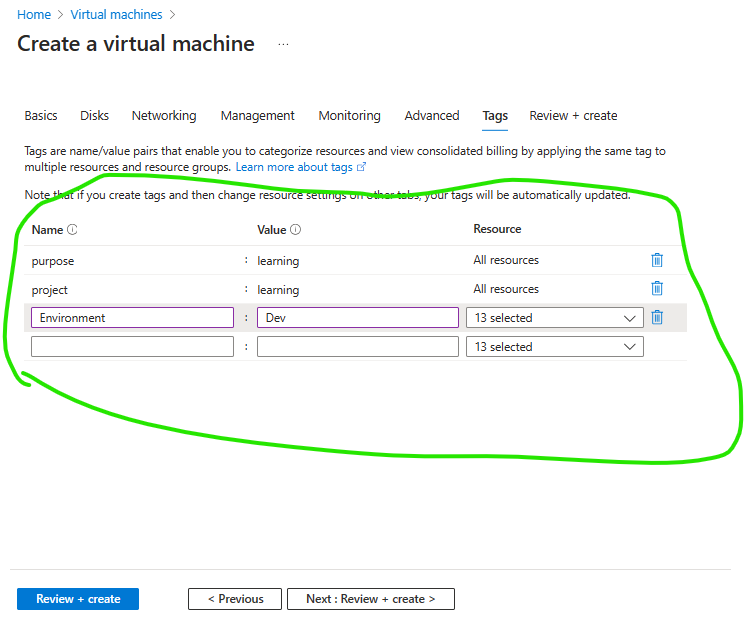
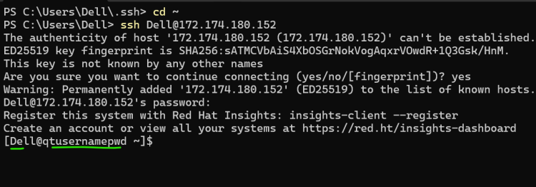
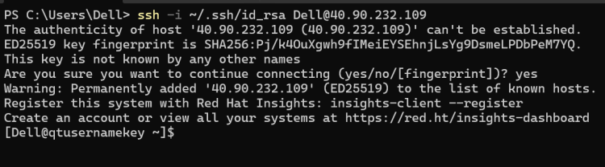

# Azure Virtual machines Contineous Class: 
## Credentials
 * Linux:
  - Username and Password
  - Username and key
 * Windows
  - Username and Password
 * **Key: Azure has a service** where you can create private key and public key (key pair) or import your existing keys

 * To create a key on your system ssh-keygen
 * Now create a key pair and upload the public key

 

 * We can get the private key from Azure

 

 

## Login into vms
 * Windows:
    * RDP (Remote Desktop Protocol): Gives visual interface to work with windows from remote
    * command mstsc -v <ipaddress>
    * port: TCP 3389
 * Linux
   * SSH (Secure Shell): Gives shell interface /terminal access to work with linux vms
   * command
      * with username and password ssh username@ipaddress
      * with username and key ssh -i <path to private key> username@ipaddress
      * port: TCP 22
 * Note:
   * If your vm is created with key and if you execute ssh username@ipaddress it checks for the key in ~/.ssh/id_rsa

## Tags
 * When we create any resource we can tag the resources.
 * Tagging is helpful for
     * querying resources
     * filtering bills
 * Whenever you create any resource atleast have these tags
     * project: learning
     * env: dev
     * purpose: learning

# Create linux vm with username and password
  * For screen shots watch the clasroom video

* Create linux vm with username and key
For screen shots watch the clasroom video

 

# Exercise
  - Ensure you have a default rsa key setup in your machine. If you already have an ssh key use it
  - Import default rsa key into ssh keys
  - Create a linux vm with this key and execute ssh in all the 3 combinations shown in the class