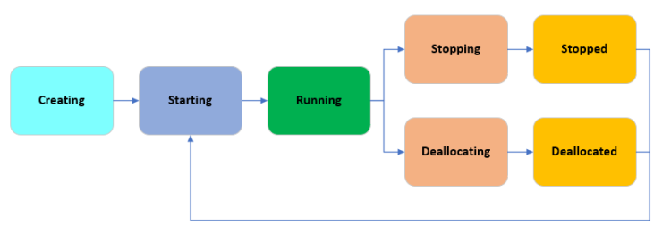
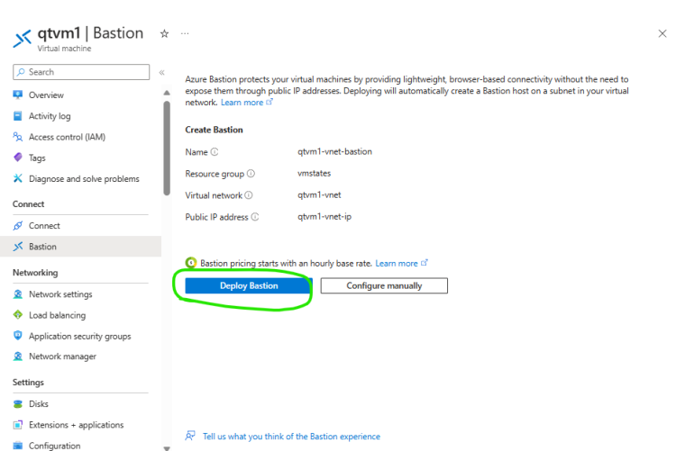
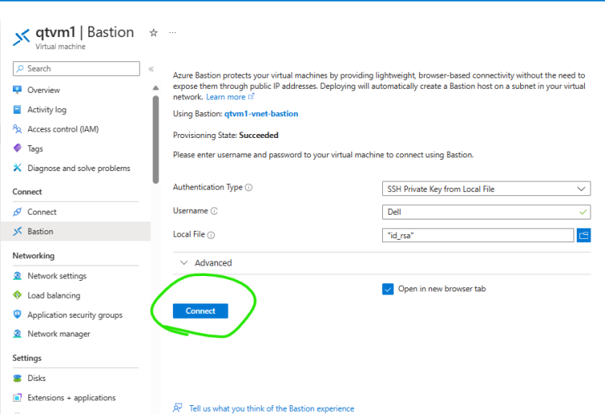
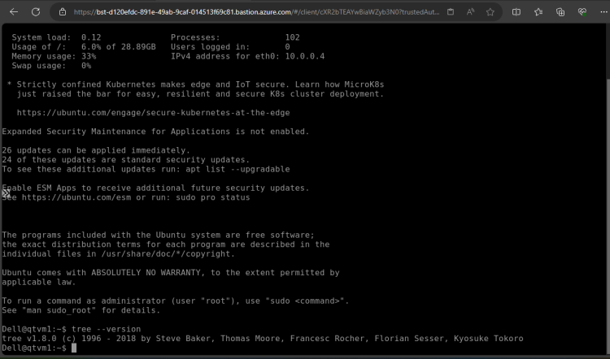
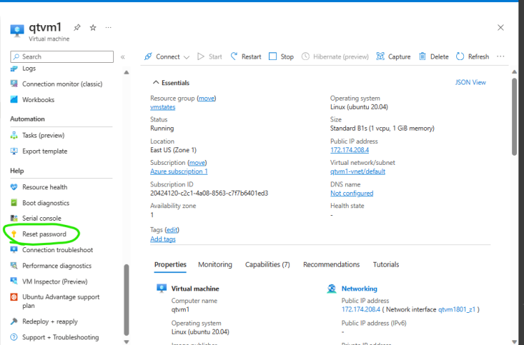
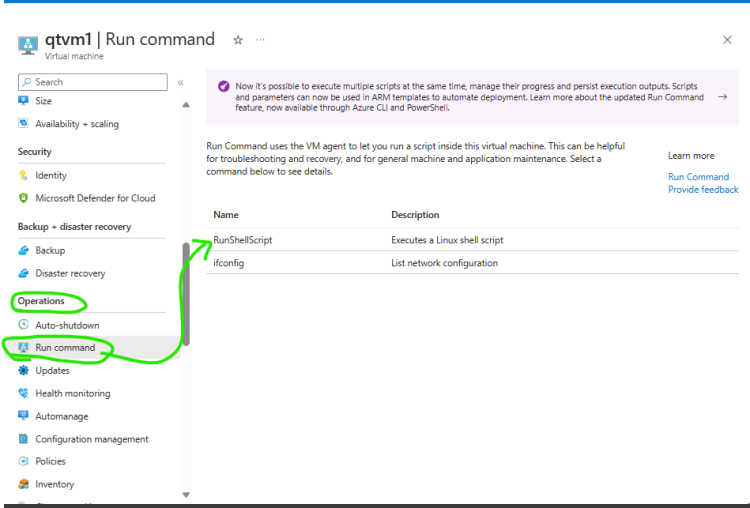
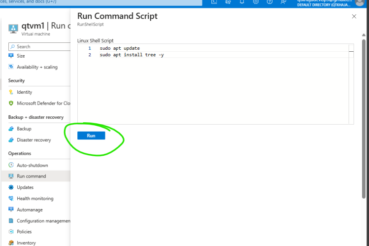
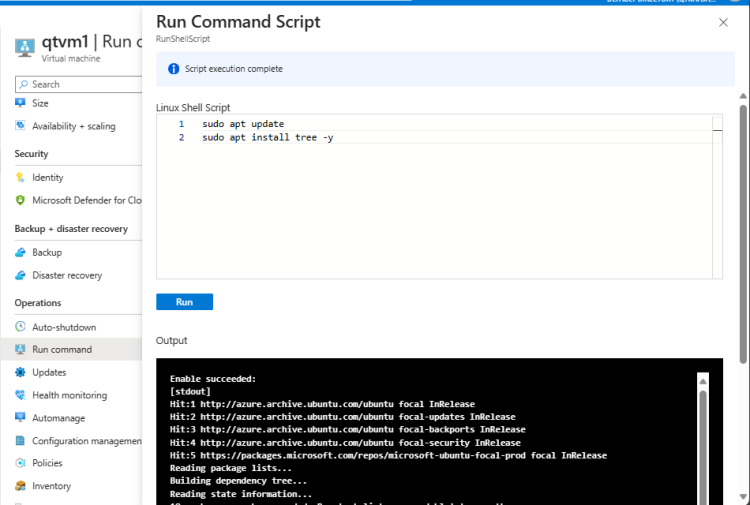

# Azure Compute – Virtual Machines

 * Virtual Machine Life Cycle (States): This is for on-demand instances
[ReferHere](https://learn.microsoft.com/en-us/azure/virtual-machines/states-billing#power-states-and-billing)
 * In Azure when we stop the vm from portal or from cli we are deallocating

 

# Azure Virtual Machine connectivity : Bastion Host

 * In the last session we had spoken about ssh and rdp
 * Azure allows to connect to Azure VMS using
     * Native SSH or RDP
     * SSH using Azure CLI
     * Bastion
 * **Bastion-Host** is considered to be safe as we need not expose RDP and SSH Ports to all ips

 

 * Enterprise Clients prefer using Bastion for connecting vms’s securely
 * Note: [Refer Here](https://learn.microsoft.com/en-us/azure/bastion/native-client) for using Bastion over native clients
 * After deploying bastion

 

 

 # Azure Virtual Machine – Extra’s && SelfHelp

* Reset Passwords: Help -> Reset Passwords

* We can run the commands in Azure VMs directly without credentials if you have virtual machine administrator rights by using run command
* Azure Vms have agents which make this possible
* Auto Shutdowns

# Exercise:
* Create an Azure Virtual Machine and then
   * Reset Password
   * Install java into ubuntu from Run command sudo apt update && sudo apt install openjdk-17-jdk -y
* Create an Azure Billing estimate for running
   * 1 vm with ubuntu linux for 1 month
   * disk size is 64 GB

