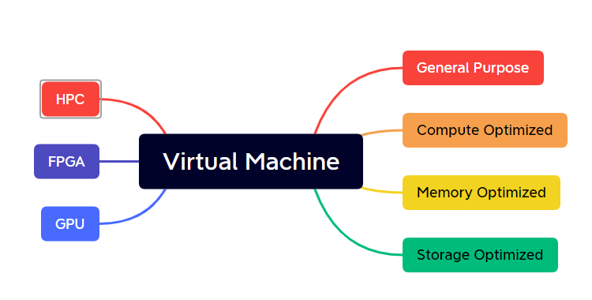
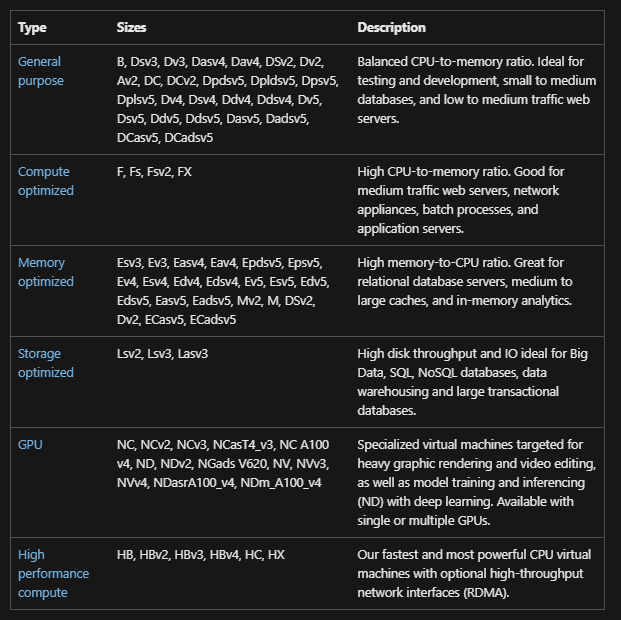
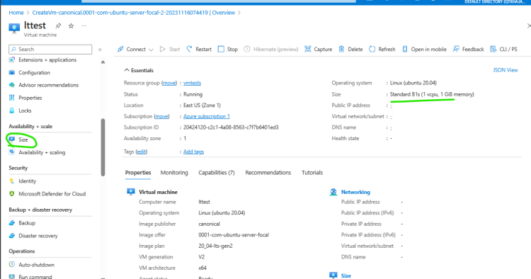
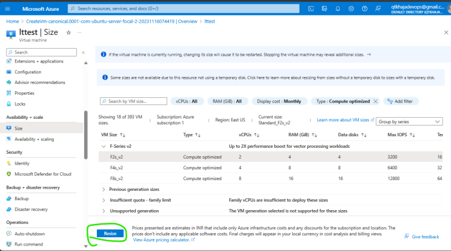

# Azure Compute – Virtual Machines

## Virtual Machine Sizes

* VMs are categoriezed by purpose which is referred as type
* Each virtual machine which we create will be from some physical server
* Azure Vm size naming convention [Refer Here](https://learn.microsoft.com/en-us/azure/virtual-machines/vm-naming-conventions)
* Note: We can create a Azure vm with one size or type and then resize to other size (type)

## Resize Vm

* Create a vm with size B1s
* Changing the size of virtual machines is referred as vertical scaling.
* Lets look at two terms
    * scale up and scale down (Vertical scaling)
    * scale in and scale out (Horizontal scaling)
* Every Vmsize in Azure dictates the following

    * Family (Subfamily)
    * Additive
    * Number of cpus
    * RAM size
    * Data Disk count
    * Temp Disk size
    * Max IOPS (Disk speed max)

* Price of virtual machine

    * price of vm size
    * price of disk
    * price of public ip

* [Refer Here](https://azure.microsoft.com/en-in/pricing/calculator/) for pricing calculator
* Virtual machine selector [Refer Here](https://azure.microsoft.com/en-us/pricing/calculator/)