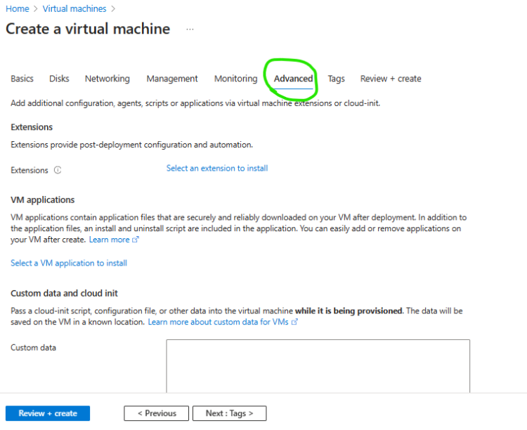
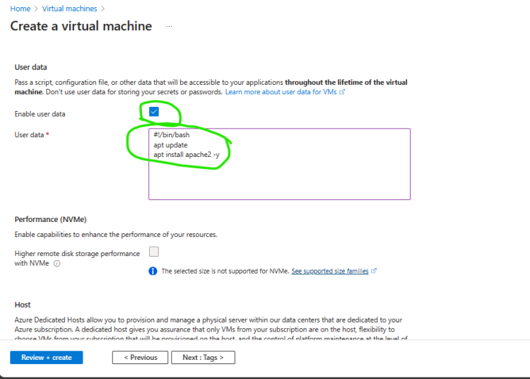
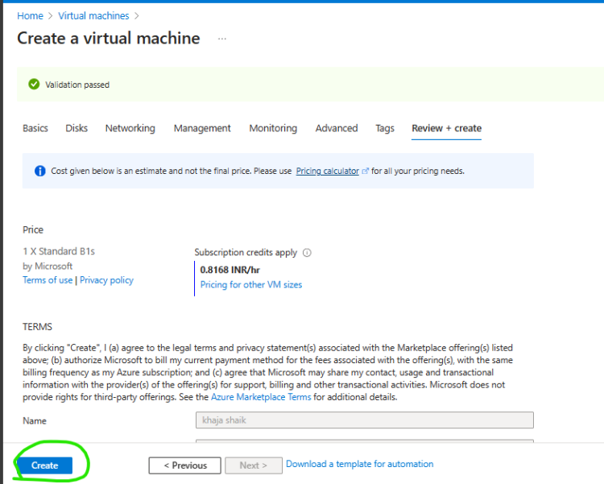
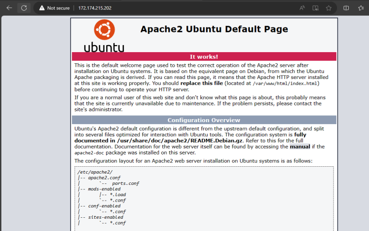
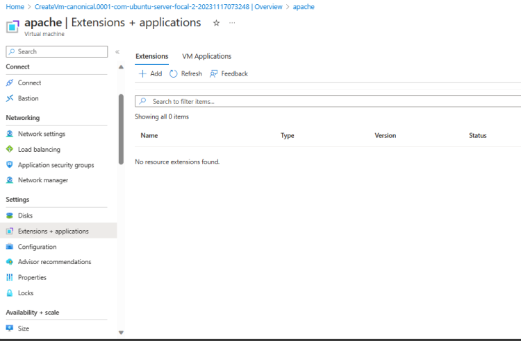
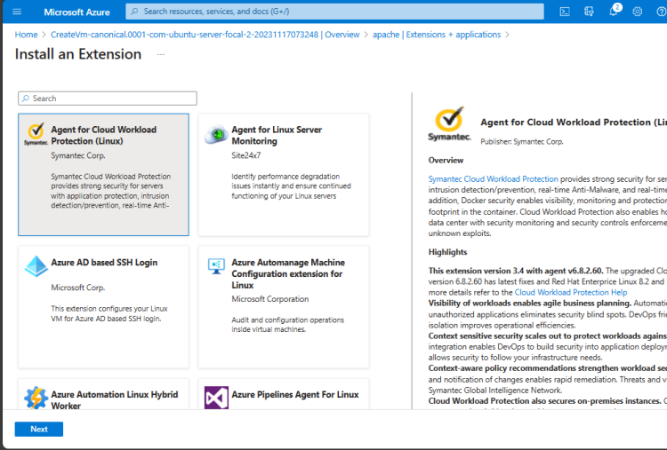

# Azure USER_Data Usecases :

* Azure Compute – Azure Vm

## Activity Manual Vs Userdata Examples Explained :
   * Create a ubuntu linux vm with 22,80 (ssh,http) port
   * ssh into the vm and execute the following
         * sudo apt update
         * sudo apt install apache2 -y
   * access from browser http://publicip
  * We can use user data. User data executes after the vm creation. To use user data use the Advanced tab and select user data and enter the following
         * #!/bin/bash
         * apt update
         * apt install apache2 -y
  * Custom data allows us to use cloud-init which is a yaml file [Refer Here](https://cloudinit.readthedocs.io/en/latest/reference/examples.html) for more

## Azure vm extensions
 [Refer Here](https://learn.microsoft.com/en-us/azure/virtual-machines/extensions/overview) for official docs

 

 

## Azure VM Applications
[Refer](https://learn.microsoft.com/en-us/azure/virtual-machines/vm-applications?tabs=template%2CVMSS%2Cubuntu) Here for official docs

## Azure Compute Gallery
[Refer Here](https://learn.microsoft.com/en-us/azure/virtual-machines/create-gallery?tabs=portal%2Cportaldirect%2Ccli2) for creating a gallery
TBD: We will be using compute gallery to store vm images

## Azure Instance metadata service
[Refer Here](https://learn.microsoft.com/en-us/azure/virtual-machines/instance-metadata-service?tabs=linux) for docs