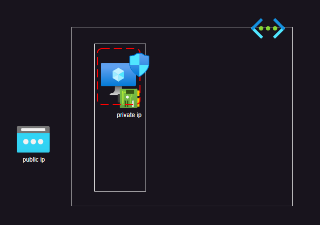
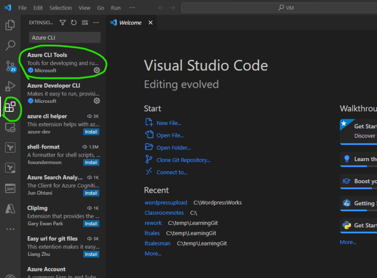

# Network Security Groups
* Network security groups are attached to nic and they have allow or deny rules

## Virtual Machine Creation
  * Required:
       * Resource Group
       * Virtual Network and subnet
       * Network security group
       * Network interface
       * Virtual machine

# Azure CLI
 * Azure CLI is a command line way of interacting with azure
 * Installation: [Refer Here](https://learn.microsoft.com/en-us/cli/azure/install-azure-cli?view=azure-cli-latest)
 * [Refer Here](https://www.youtube.com/watch?v=9guzVbZPGuw&t=3s) for installation.
 * How to find cli commmands
     * Navigate to [Refer Here](https://learn.microsoft.com/en-us/cli/azure/?view=azure-cli-latest)
     * And click on reference
      

 * Ensure Azure CLI Extension is installed in visual studio code
      

     * refer to classroom video on how to build cli
     * The cli developed in the session

# Creating the Resources thrugh CLI:

# login
# az login

# create a resource group
az group create --location "eastus" --name "vmfromcli"

# Create a network 
az network vnet create --name "vmnet" --resource-group "vmfromcli"

# Create a subnet
az network vnet subnet create `
    --name "web" `
    --resource-group "vmfromcli" `
    --vnet-name "vmnet" `
    --address-prefixes "10.0.0.0/24"

# Create a network security group

az network nsg create `
    --name "webnsg" `
    --resource-group "vmfromcli" `
    --location "eastus" 

# Create a rule to open 80 port to every one
az network nsg rule create `
    --name "openhttp" `
    --resource-group "vmfromcli" `
    --nsg-name "webnsg" `
    --priority 1000 `
    --access Allow `
    --source-address-prefixes "*" `
    --destination-address-prefixes "*" `
    --destination-port-ranges "80" `
    --source-port-ranges "*" `
    --direction "Inbound" `
    --protocol "Tcp"

# Create a rule to open 22 port to every one
az network nsg rule create `
    --name "openssh" `
    --resource-group "vmfromcli" `
    --nsg-name "webnsg" `
    --priority 1100 `
    --access Allow `
    --source-address-prefixes "*" `
    --destination-address-prefixes "*" `
    --destination-port-ranges "22" `
    --source-port-ranges "*" `
    --direction "Inbound" `
    --protocol "Tcp"

# Create a nic with only private ip attached to web subnet with webnsg
az network nic create `
    --name "webnic" `
    --resource-group "vmfromcli" `
    --location "eastus" `
    --vnet-name "vmnet" `
    --subnet "web" `
    --network-security-group "webnsg"

# Create a vm
az vm create `
    --name "webvm" `
    --resource-group "vmfromcli" `
    --location "eastus" `
    --admin-password "azurevmfromcli@123" `
    --admin-username "dell" `
    --nics "webnic" `
    --image "Ubuntu2204"

## Exercise: Create the same with public ip.