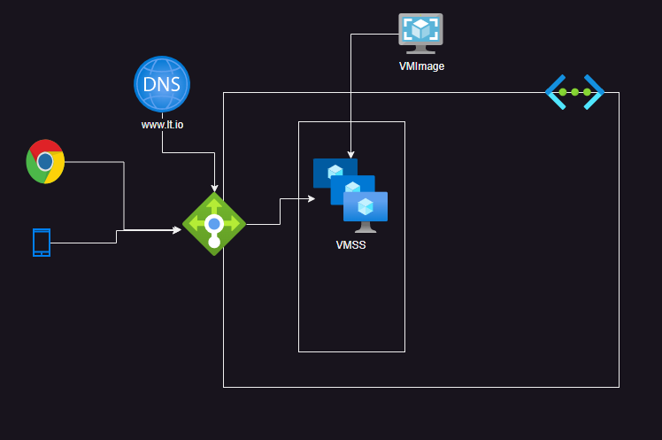

# Azure Powershell:
 * Azure Offers command line capabilities over powershell
 * Powershell will have cmdlets which will be in the form of verb-noun
 * [Refer Here](https://learn.microsoft.com/en-us/azure/virtual-machines/linux/quick-create-powershell) for powershell to create a linux vm

 # Azure VM Creaton:

 * Create a ubuntu linux vm and install the following

     * sudo apt update
     * sudo apt install apache2 stress -y
     * sudo apt install php libapache2-mod-php php-mysql -y
 
 * Create a file at /var/www/html/info.php with following content

     <?php
     phpinfo();
     ?>

 * Access the http://publicip/info.php
 * Big Picture for Horizontal Scaling with Zero down time deployments

 