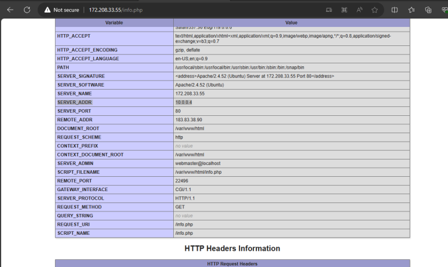
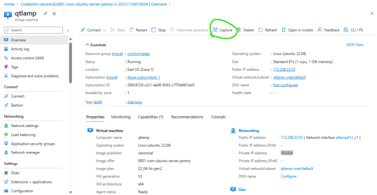
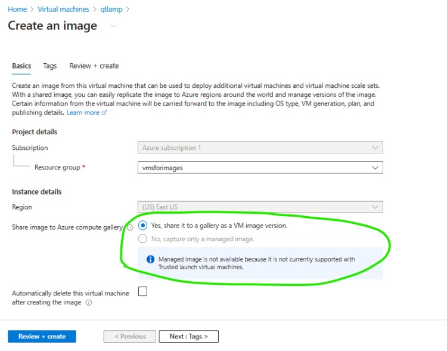
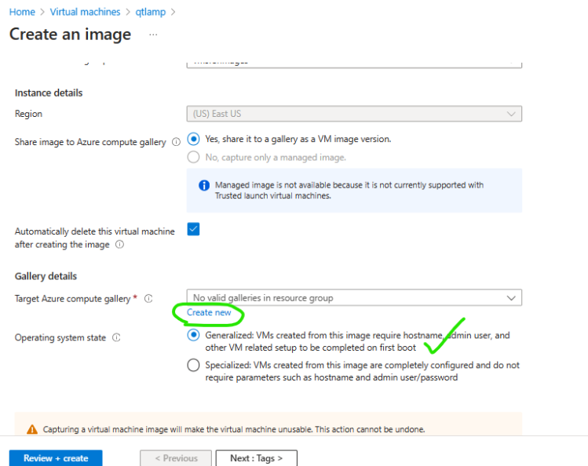
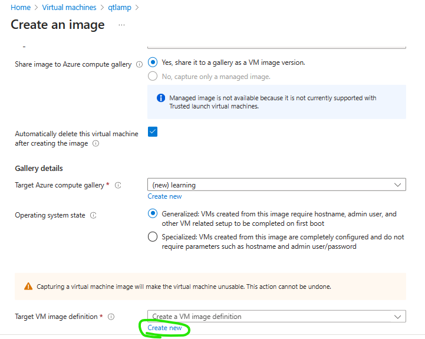
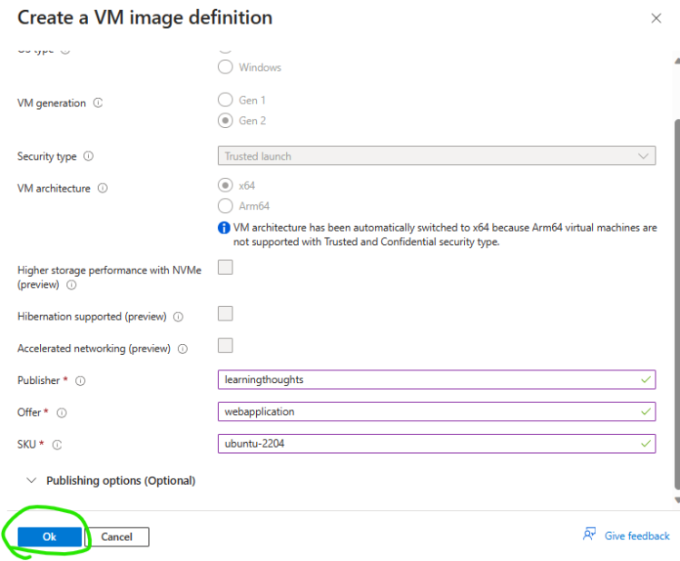
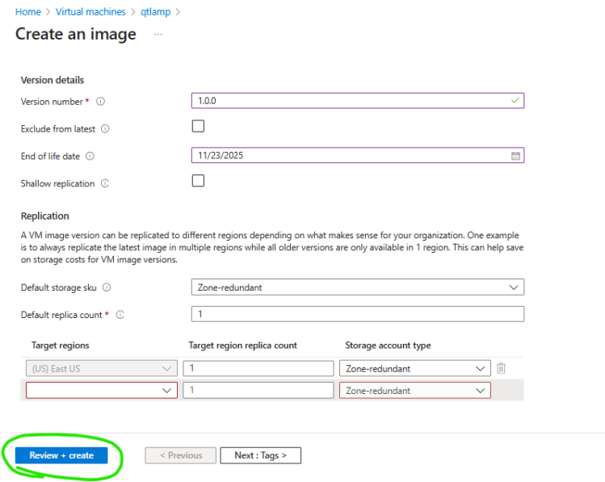
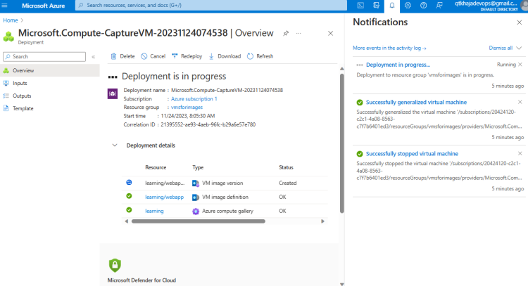
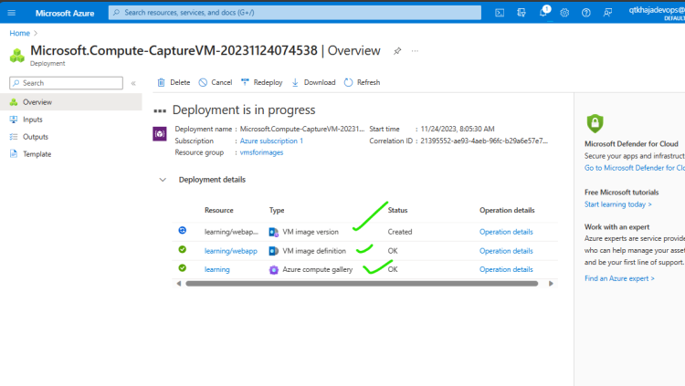
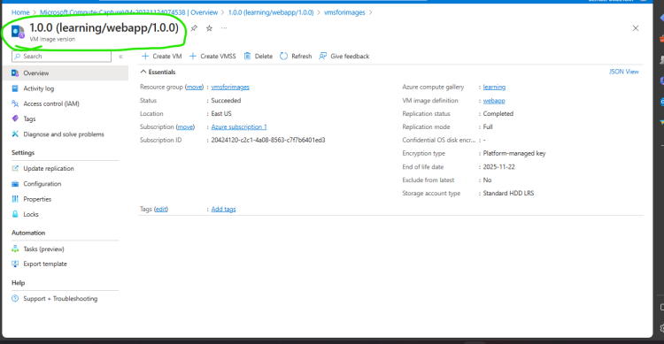

# Generation I vs Generation II vms
 * Generation I is older version of VMS
 * Generation II supports new generation with feature support such as
       * larger vm sizes
       * uefi and vTPM (Secured Boot) (Trusted => OS Secured)
       * Resizing Disks on the fly
       * Faster OS boot times
      
      
# VM Image Creation
* Azure VM Images are of two types
   * Generalized:
      * These images allows to set credentials while creating virtual machine
   * Specialized:
      * These image have a built in user and will not allow you to set credentials during creation.
* Azure VM Images can be hosted by two ways
     * Managed Image
     * Azure Compute Gallery (Supports versioning)

## Lets create our first vm image

* Create a ubuntu vm with apache with php installed

* Create a resource group called as resuableimages
* Navigate to the vm & then click on capture button

Lets create a gallery called as learning

* Every VM Image in Azure is identified by 4 parameters
    * publisher: referes to an organization publishing images
    * offer: This is the offering from the organization
    * sku: This is store keep unit
    * version: version of the release
* Now lets create a vm definition with our details in publisher, offer and sku

* VM Image creation happens in 3 steps
  * stop the vm
  * Generalize the vm (Remove user credentials)
  * Create a snapshot of disk with additional metadata to create a vm image

