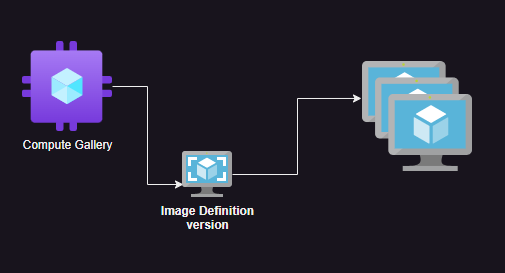

# Azure Virtual Machine Scaleset (VMSS)

* Virtual machine scaleset allows to perform automatic horizontal scaling based on metrics such as cpu, network, memory or even custom metrics
* To Create a virtual machine scaleset we need a image. Here we have two choices, use
     * OS image
     * Custom image with application preinstalled
* Using Custom image is widely adopted option.
* We will be creating a VMSS using the image which we stored in compute gallery

* [Refer Here]() FOR Offical docs

