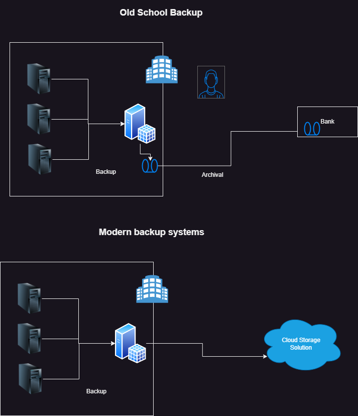
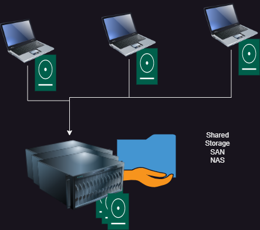

# Storage in Cloud
 * Storage Needs in organization
 * Backup and Recovery Needs

 

 

## Disk storage:
  * Single System Disks
  * Network Disks (NAS, SAN)
  * Databases
  * Big Data/Data Lakes
  * Blob Storage (Binary Large Object)

## Terms:

### Backup:
  * This refers to the solutions applied to recover quickly.
  * The Backup will have recovery points less than one day.
  * Is generally present in the same building (office/branch/sit)
### Archival:
  * This refers to the solutions applied to recover from disasters.
  * The Archival will have recovery points atleast weekly
  * Is generally present in the different site.
### Restore: 
  * Recovering the data from backup or archival is referred as restore.
### Recovery Point Objective (RPO): 
  * This determines the effectiveness of backup (i.e. one week or one day or one hour)
### Single Point of Failure (SPoF):
  * BCDR (Business Continuity and Disaster Recovery)
### Migration

### Availability: 
  * This is the ratio used to tell how much % of the time data is accessible to you
### Durability: 
  * This is a measurement used in Storage industry as the % to tell the data will not be corrupted or lost.
### Redundancy: 
  * Having multiple copies of data. This increases Availability as well as durability
### Gibi byte (GB) vs giga byte (GiB)

### sku (store keep unit)

### SLA (Service Level agreement) :
  * [Refer Here](https://www.azure.cn/en-us/support/sla/storage/)

### Exercise
   * What is (Interms of storage)
   * Durability
   * Availability