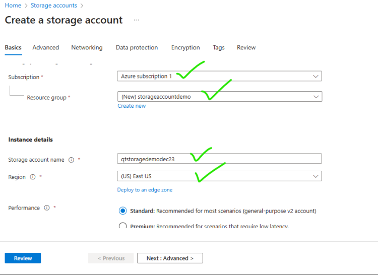

# Azure Storage Account
* This is a service offered by Microsoft  Azure to store
  * Blobs:
    * Block Blobs: This is file (Blob)
    * Page Blobs: This represnts virtual hard disk
    * Append Blobs: This is used for storing logs
  * File Share
  * Table Storage
  * Queue Storage

* Storage account has a naming convention [Refer Here](https://learn.microsoft.com/en-us/azure/azure-resource-manager/management/resource-name-rules#microsoftstorage) and the name of the storage account has to be unique

* Resource Creations
  * Azure resource hierarchy: To create Resources we need a resource group
    

## Create a storage account using portal
  * Create the storage account [Refer Here](https://learn.microsoft.com/en-us/azure/storage/common/storage-account-create?tabs=azure-portal)

  

  

* Upload a file and give access to every one in storage account
  * This requires containers, so lets create one

  

  

  * To allow anonymous access navigate to settings blade configuration

  

  

  

  * Now lets get into container and upload some vidoes

  

  

  * Now lets find the url to access the videos

  

  

* Browse the url:
   * https://qtstoragedemodec23.blob.core.windows.net/videos/one.mp4
   * https://qtstoragedemodec23.blob.core.windows.net/videos/two.mp4
   * https://qtstoragedemodec23.blob.core.windows.net/videos/three.mp4

* Pattern: https://<storage-account-name>.blob.core.windows.net/<container-name>/<file-name>

## Creating Azure Free Account
  * Create a microsoft account [Refer Here](https://www.microsoft.com/en-us/microsoft-365/outlook/email-and-calendar-software-microsoft-outlook?deeplink=%2fowa%2f&sdf=0)
  * [Refer Here]() for the link
  * Once the accont is created to login into azure [Refer Here](https://portal.azure.com/)