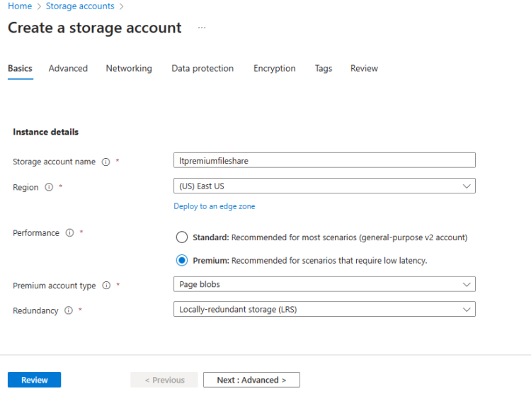

# Azure Storage Account

## Redundancy

 * Redundancy: This is about multiple copies of the data maintained by azure internally [Refer Here](https://learn.microsoft.com/en-us/azure/storage/common/storage-redundancy)

 * LRS (Locally redundant storage) : [Refer Here](https://learn.microsoft.com/en-us/azure/storage/common/storage-redundancy#locally-redundant-storage)

   

 * ZRS (Zone Redundant storage): [Refer Here](https://learn.microsoft.com/en-us/azure/storage/common/storage-redundancy#zone-redundant-storage)

   

 * GRS (Geo-Redundant Storage): [Refer Here](https://learn.microsoft.com/en-us/azure/storage/common/storage-redundancy#geo-redundant-storage)

  

 * GZRS (Geo-zone-redundant storage): [Refer Here](https://learn.microsoft.com/en-us/azure/storage/common/storage-redundancy#geo-zone-redundant-storage)

 

* **Synchronous Replication:** Upload is not completed until all the replications are completed (LRS, ZRS) and Asynchronous 
* **Replication:** Upload is done asynchronous i.e. upload is shown as completed during replication primary copy to secondary cop

## Performance

* Azure Storage accounts has different types of storage accounts on the basis of two primary factors
  * **Standard:** They are used for general purpose, with each storage account serving
       * blob storage
       * Table Storage
       * File share
       * Queue Storage
  * **Premium:** For low latency solutions premium is used. Premium Blobs support only LRS or ZRS. Premium storage accounts have
      * Premium blob blobs
      * Premium file share
      * Premium page blob

## Lets Create all possible storage account types:

 * [Refer Here](https://learn.microsoft.com/en-us/azure/storage/common/storage-account-overview#types-of-storage-accounts) for all the possible storage accounts.

 * Standard Storage account with GZRS Redundancy

 * Premium Block Blob Storage with ZRS Redundancy

 * Premium File Share with LRS Redundancy

 * Premium Page Blob Storage with LRS Redundancy

 

 