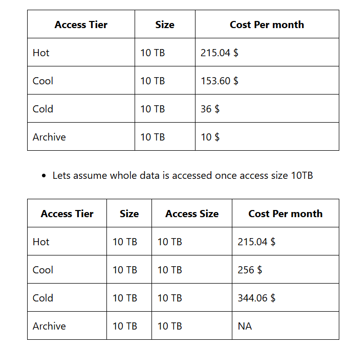
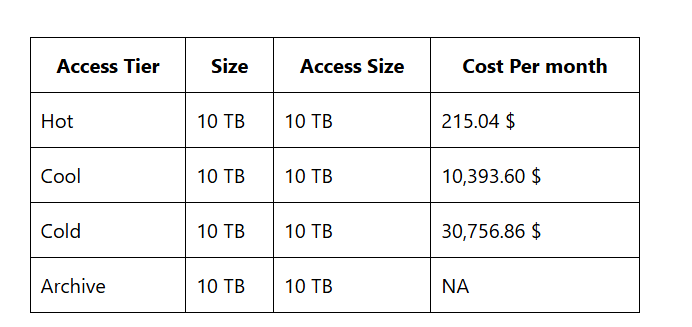

# Block Blobs
  * Block Blobs represent files. Files of any format can be uploaded in Block Blob Storage
  * Azure storage account needs a logical storage space called as containers to store blobs
  * Block Blob (Blob) access can be restricted.
  * Azure storage account supports public read (anonymous read) access at container level and the data can be private. Can be shared with specific people using access keys or shared with specific people for a specific period of time using shared access signatures (SAS)
  * Access tiers: Access tiers select the pricing model [Refer Here](https://learn.microsoft.com/en-us/azure/storage/blobs/access-tiers-overview)
      * Hot
      * Cool
      * Cold
      * Archive

 * Pricing of Access tiers:
 * Azure pricing calculator: [Refer Here](https://azure.microsoft.com/en-gb/pricing/calculator/)

 * In the below table we are estimating storage cost for 10 TB in East US for different tiers

 * Lets assume whole data is accessed once access size 10TB

 * Lets assume whole data is accessed 100 times access size 1000 TB

 * Azure supports life cycle for changing access tier with patterns in days which can help in saving costs and administrative efforts.
 * Versions in storage accounts: This helps in building repository based applications.
 * ReHydrate Blob: [Refer Here](https://learn.microsoft.com/en-us/azure/storage/blobs/archive-rehydrate-to-online-tier?tabs=azure-portal)