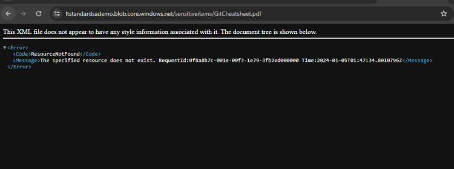

# ALL Activtes Must practise:
================================

## Activity 1: Upload a file to Container
  * Note: for screenshots refer classroom video
  * Standard Storage
  * Premium Block Blob storage

## Activity 2: Enable anonymous access to the container
  * By default in azure storage account anonymous access is disabled
  * We can enable in from the settings –> Configuration –> Allow Blob anonymous access to enabled and save
  * Select the container and change acess level
  * Access any blob and get the url
  * Exercise:
      - upload resume document (pdf or docx) to azure storage account

## Activity 3: Accessing the private item
  * [Refer Here](https://learn.microsoft.com/en-us/azure/storage/common/storage-sas-overview) for SAS (Shared access signature)
  * SAS is temporary access to an item for a limited time period
  * Acess Keys in Storage Account: [Refer Here](https://learn.microsoft.com/en-us/azure/storage/common/storage-account-keys-manage?tabs=azure-portal)
  * Create a container with private access
   

  * upload some item into private container and try accessing from url
  

  * Every storage account will have two access keys key1 and key2. These keys can be used to access the storage account content programatically
  * Now lets generate SAS for a blob item based on key1

   

   

   

   

 * Now access the object using url with SAS token
 * This stops working in two cases
    * date is expired
    * acess key is rotated

## Activity 4: Rotate access keys
  * Since access keys give programatic access to storage account. It is recommended to rotate access keys
  * [Refer Here](https://learn.microsoft.com/en-us/azure/storage/common/storage-account-keys-manage?tabs=azure-cli#manually-rotate-access-keys) for the section

## Activity 5: exploring containers
 * Create a resource group and a storage account (Standard)
 
 

  * Upload two files (one.txt two.txt) in two private containers
  * make a note of resource group, storage account, container name
  * delete the resource group
  * Can we recover yes
    * We can recover
        * blob
        * container
        * storage account.
  * Lets understand soft delete. The delete object will not be actually delete but marked for delete for 7 days (configured days)
  * [Refer Here](https://learn.microsoft.com/en-us/azure/storage/common/storage-account-recover) for recovering storage account

  

## Activity 5: Enable versioining for a blob
 * [Refer Here](https://learn.microsoft.com/en-us/azure/storage/blobs/versioning-enable?tabs=portal) to enable versioning in  Azure Storage account
 * Once the version is enabled and the object is uploaded navigate to versions section to find all the versions of the blob

   

## Activity 6: Enable versioning extended
 * Create a standard storage account (if doest not exists)
 * Create a container called as docs
 * Create a blob called as topics.txt
 * try uploading with some topics
 * Enable versioning
 * now add some more content to topics.txt and upload as a new version.
 * Delete the older version and try restore.
 * [Refer Here](https://learn.microsoft.com/en-us/azure/storage/blobs/soft-delete-blob-manage#restore-soft-deleted-blobs-when-versioning-is-enabled) for the solution

## Activity 7: Lifecycle Managment
 * Azure Storage account supports lifecycle management to change access tiers.
 * [Refer Here](https://learn.microsoft.com/en-us/azure/storage/blobs/lifecycle-management-policy-configure?tabs=azure-portal) for lifecycle management policy
 * Manually change access tier

    
   
    
   
    
   
    

## Activity 8: Snapshots
 * Snapshot/Backup of storage account containers or blobs
 * Select the object and generate snapshot

## Activity 9: Replications
 * Redundancy is already done on the basis of LRS/ZRS/RA-GZRS
 * Replication, replicates the storage account contents to other storage belonging to same account or different account.
 * Now lets upload a new file to both containers and then experiment and observe the results.

  
  

## Activity 10: Static Website Hosting
 * A fully functional website which is developed in CSS, HTML and javascript can be directly hosted in storage account.
 * [Refer Here](https://learn.microsoft.com/en-us/azure/storage/blobs/storage-blob-static-website) for official docs
 * As done in the class, install  Azure storage explorer for copying folders easily
 * Download any website template [Refer Here](https://templatemo.com/)
 * enable static website hosting and copy the contents to $web container.

## Activity 11: Using Azure Storage account for Data Lakes
[Refer Here](https://learn.microsoft.com/en-us/azure/storage/blobs/data-lake-storage-introduction) for using azure storage account as datalake

