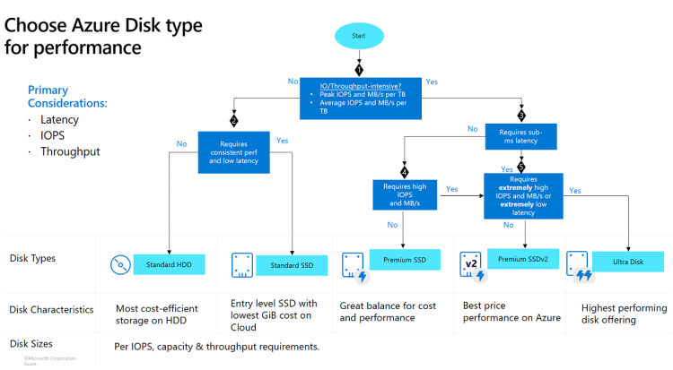

# Azure Managed Disks
* This is a managed service for disks in azure
* Azure Disk Selection based on Performance
 

 * [Refer Here](https://learn.microsoft.com/en-us/azure/virtual-machines/disks-types#disk-type-comparison) for disk type comparisions
 * Azure Standard HDD disk sizes [Refer Here](https://learn.microsoft.com/en-us/azure/virtual-machines/disks-types#standard-hdd-size)
 * Azure Standard SSD disk sizes [Refer Here](https://learn.microsoft.com/en-us/azure/virtual-machines/disks-types#standard-ssds)
 * Azure Premium disk sizes [Refer Here](https://learn.microsoft.com/en-us/azure/virtual-machines/disks-types#premium-ssd-size)
 * Azure Premium SSD v2 [Refer Here](https://learn.microsoft.com/en-us/azure/virtual-machines/disks-types#differences-between-premium-ssd-and-premium-ssd-v2)
 * Ultra disk size [Refer Here](https://learn.microsoft.com/en-us/azure/virtual-machines/disks-types#ultra-disk-size)
 * Azure managed disks will be attached to vm by azure, formatting the disks and using it in os is user’s responsibility
 * Resizing disks:
     * Changing the disk type (standard, premium,ultra) is not possible when the disk is attached to running vm.
     * increasing the disk size in the same sku is possible