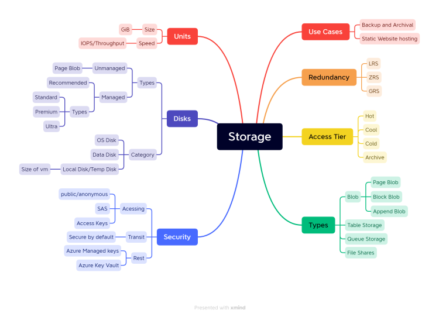

# Activities
  * Create a storage account
  * Create a container with name videos
  * Create a container with name music
  * upload any file to videos with
  * hot access
  * cool access tier
  * Upload a file with public/anonymous access
  * Access this using url
  * delete the file and restore the file
  * enable versioning and ensure you have 3 versions
  * Delete the storage account and recover.
  * Create a virtual machine and add a data disk of premium disk type of minimum size possible.

## Storage MindMap:

  

